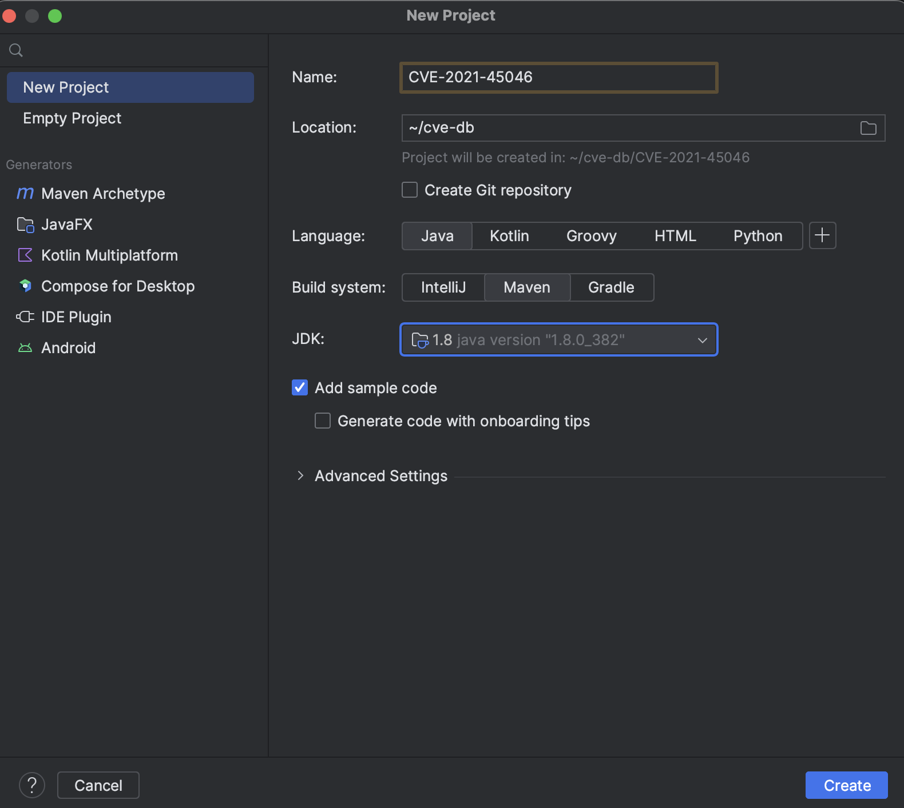

# Анализ уязвимости для пакета apache.log4j.2.15

Все действия были совершины на Mac OS с использованием intellij idea.

## Запуск эксплойта

Создаём новый проет в idea. Выбираем создание с maven и java 1.8.

